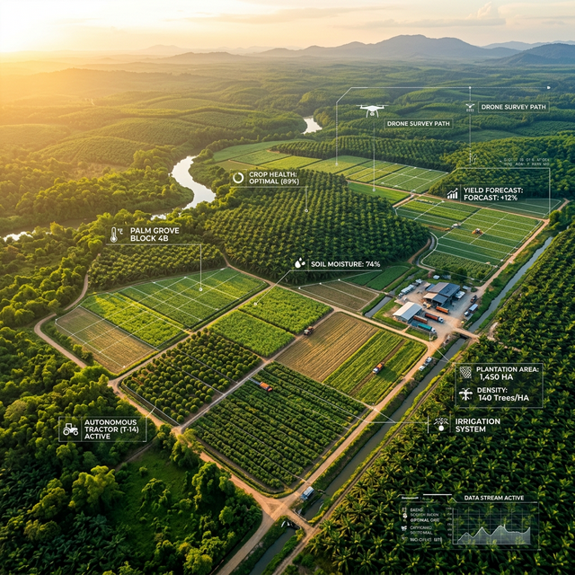

# 🌿 AgroSmart — Sistem Kontrol Perkebunan

> Platform manajemen perkebunan modern berbasis web untuk mengelola lahan, tanaman, karyawan, panen, dan keuangan secara efisien.



---

## ✨ Fitur Utama

- 🔐 **Autentikasi** — Login/Register via Email & Google OAuth
- 👥 **Multi-Role** — Superadmin, Owner, dan Operator dengan hak akses berbeda
- 🌱 **Manajemen Tanaman** — CRUD data tanaman lengkap dengan kategori & status
- 🗺️ **Manajemen Lahan** — Kelola blok lahan + GPS koordinat & integrasi Google Maps
- 👷 **Manajemen Karyawan** — Data karyawan, jabatan, kehadiran & penugasan
- 🌾 **Catatan Panen** — Rekam hasil panen, kualitas, harga per kg
- 💰 **Keuangan** — Biaya operasional, pendapatan, profit/loss per blok lahan
- 📊 **Laporan & Analitik** — Chart interaktif (produksi, tren, keuangan)
- 🌤️ **Cuaca** — Prakiraan cuaca & rekomendasi aktivitas kebun
- 🗺️ **Peta GIS** — Visualisasi lahan menggunakan Leaflet.js + OpenStreetMap
- 👨‍💼 **Manajemen Tim** — Undang operator, atur permission per modul

---

## 🛠️ Tech Stack

| Layer | Teknologi |
|-------|-----------|
| Frontend | HTML5, CSS3, Vanilla JavaScript |
| Backend / Database | [Supabase](https://supabase.com) (PostgreSQL + Auth + RLS) |
| Charts | [Chart.js](https://chartjs.org) v4 |
| Maps | [Leaflet.js](https://leafletjs.com) + OpenStreetMap |
| Font | Google Fonts (Inter, Outfit) |

---

## 🚀 Cara Setup

### 1. Clone repository

```bash
git clone https://github.com/USERNAME/agrosmart.git
cd agrosmart
```

### 2. Setup Supabase

1. Buat project baru di [supabase.com](https://supabase.com)
2. Buka **SQL Editor** di dashboard Supabase
3. Copy-paste seluruh isi file `schema.sql` → klik **Run**
4. Catat **Project URL** dan **Anon Key** dari Settings → API

### 3. Konfigurasi Supabase di Aplikasi

Edit file `supabase-config.js`, ganti dua baris pertama:

```javascript
const SUPABASE_URL  = 'https://XXXXXXXX.supabase.co'; // ganti dengan URL project kamu
const SUPABASE_ANON_KEY = 'eyJhb...'; // ganti dengan anon key kamu
```

### 4. Jalankan Lokal

```bash
# Menggunakan Node.js
node serve.js

# Atau Python
python -m http.server 8080
```

Buka `http://localhost:8080/auth.html`

### 5. Deploy ke Vercel (gratis)

[](https://vercel.com/new)

1. Push ke GitHub
2. Login ke [vercel.com](https://vercel.com)
3. Import repository → Vercel otomatis deploy!

---

## 🔐 Sistem Role

| Role | Akses |
|------|-------|
| **Superadmin** | Panel admin platform, kelola semua user |
| **Owner** | Semua fitur kebun + manajemen tim/operator |
| **Operator** | Sesuai permission yang diset oleh Owner |

---

## 📁 Struktur File

```
agrosmart/
├── index.html                    # Halaman utama (SPA)
├── auth.html                     # Login & Registrasi
├── profile-setup.html            # Setup profil pertama kali
├── admin.html                    # Panel Superadmin
├── index.css                     # Stylesheet utama
├── supabase-config.js            # Konfigurasi & CRUD helpers
├── app.js                        # Router & UI core
├── data.js                       # Data statis (dummy/contoh)
├── page-dashboard.js             # Halaman Dashboard
├── page-tanaman-lahan-karyawan.js # Halaman Tanaman, Lahan, Karyawan
├── page-panen-laporan-cuaca.js   # Halaman Panen, Laporan, Cuaca
├── page-keuangan.js              # Halaman Keuangan
├── page-peta.js                  # Halaman Peta GIS
├── page-team.js                  # Halaman Manajemen Tim
├── schema.sql                    # Database schema (Supabase)
└── rls_fix_patch.sql             # SQL patch untuk update RLS
```

---

## 📸 Screenshot

*Dashboard, Peta, dan Fitur Keuangan tersedia setelah login.*

---

## 📄 Lisensi

MIT License — bebas digunakan dan dikembangkan.
